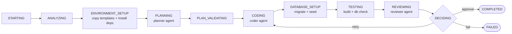

# 🤖 web-sub-agent


> Pipeline tự động sinh **web app full-stack** bằng 3 AI sub-agent:
> **Planner** lập kế hoạch → **Coder** viết code → **Reviewer** duyệt và quyết định.

Stack chuẩn của app được sinh: **Next.js** (frontend) + **FastAPI** (backend) + **PostgreSQL** (database).

## 📑 Mục lục

- [Tính năng](#-tính-năng)
- [Kiến trúc pipeline](#-kiến-trúc-pipeline)
- [Bắt đầu nhanh](#-bắt-đầu-nhanh)
- [Tạo web mới](#-tạo-web-mới)
- [Web mẫu: EnglishFun](#-web-mẫu-englishfun)
- [API reference](#-api-reference)
- [Database](#-database)
- [Scripts](#-scripts)
- [Bảo mật](#-bảo-mật)
- [Deploy](#-deploy)
- [Nguyên tắc làm việc](#-nguyên-tắc-làm-việc)

## ✨ Tính năng

- 🔄 Pipeline 10 trạng thái với **retry tự động** (`DECIDING` quay về `CODING`, tối đa `PIPELINE_MAX_ITERATIONS` lần)
- 🧠 3 role agent tách biệt, cấu hình model tập trung ở `src/config/models.ts`
- 🛡️ Không có binary `opencode` vẫn chạy được nhờ **fallback**: kế hoạch mẫu, giữ code workspace, duyệt theo kết quả test
- 🐘 Database bắt buộc: tự tạo DB → chạy migration `*.sql` → seed dữ liệu
- ✅ Test gate: build production Next.js + kiểm tra Postgres trước khi approve
- 🪟 Chạy ổn trên Windows (`npm.cmd`, `shell: true`, `NODE_ENV=production` khi build)

## 🧩 Kiến trúc pipeline



Mỗi workspace sinh ra nằm ở `workspaces/<pipeline-id>/{frontend,backend}`, artifact ở `artifacts/pipelines/`.

## 🚀 Bắt đầu nhanh

**Yêu cầu:** Node.js 22+, Python 3.12+ (`pip`), PostgreSQL đang chạy. Không bắt buộc CLI `opencode`.

```powershell
copy .env.example .env   # sửa POSTGRES_PASSWORD cho đúng
npm install
npm run check            # typecheck + unit test
```

## 🆕 Tạo web mới

```powershell
npm start -- "<mô tả web>" --id <ten-web>
# ví dụ:
npm start -- "English learning app" --id english-1
```

Pipeline sẽ scaffold code từ `templates/`, cài deps, migrate + seed DB, build, test và báo `COMPLETED` kèm đường dẫn `frontend`/`backend`.

## 📚 Web mẫu: EnglishFun

Trang web để thử : https://english-fun-omega.vercel.app

Web luyện tiếng Anh phong cách IELTS (`workspaces/english-1`, tiếng Việt, 302 từ, 6 chủ đề).

| Trang        | Chức năng                                                              |
|--------------|------------------------------------------------------------------------|
| 🏠 Trang chủ | Hero + thẻ kỹ năng màu sắc + đếm số từ thật từ DB                      |
| 🔤 Từ điển   | Tra Anh/Việt, lọc chủ đề, IPA, ví dụ, nút 🔊 phát âm                   |
| 🃏 Flashcards| Lật thẻ, trộn bài, đếm từ đã thuộc, nghe phát âm                       |
| 🏆 Quiz      | 10 câu ngẫu nhiên, thanh tiến trình, đúng/sai tô màu, tự lưu điểm      |
| 📈 Tiến độ   | Số lượt làm, % đúng TB, cấp độ (🌱→🏆), lịch sử điểm                    |

**Chạy thử local:**

```powershell
# Terminal 1 — backend
cd workspaces/english-1/backend
$env:POSTGRES_PASSWORD='<mat-khau-postgres>'
python -m uvicorn app.main:app --port 8000

# Terminal 2 — frontend
cd workspaces/english-1/frontend
npm run dev -- --port 3000
```

Mở `http://localhost:3000` → làm Quiz → xem điểm ở Tiến độ.

## 🔌 API reference

Base URL: `http://localhost:8000`

| Method | Endpoint               | Ý nghĩa                       |
|--------|------------------------|-------------------------------|
| GET    | `/health`              | Trạng thái + DB (không lộ secret) |
| GET    | `/api/words?topic=`    | Liệt kê từ theo chủ đề        |
| GET    | `/api/words/search?q=` | Tra từ Anh/Việt (tối đa 20)   |
| GET    | `/api/topics`          | Chủ đề + số lượng             |
| GET    | `/api/quiz/random`     | Đề ngẫu nhiên (`count` 1–50)  |
| GET/POST | `/api/progress`      | Lịch sử / lưu điểm (validate `score ≤ total`) |

## 🐘 Database

- Schema + seed quản lý bằng file `backend/migrations/*.sql` chạy theo thứ tự tên.
- Bảng: `words` (`en` UNIQUE, `vi`, `ipa`, `example`, `topic`), `quiz_results`, `health`, `demo_items`.
- Xem nhanh: `npm run db` (tất cả), `npm run db -- words 50`, `npm run db -- quiz`, `npm run db -- tables`.
- Migrate workspace bất kỳ (kể cả DB cloud với `POSTGRES_SSL=true`): `npm run db:migrate -- workspaces/english-1`.

## 🛠️ Scripts

| Lệnh              | Ý nghĩa                                              |
|-------------------|------------------------------------------------------|
| `npm start`       | Chạy pipeline sinh web                               |
| `npm run check`   | `typecheck` + unit test                              |
| `npm run db`      | Xem database                                         |
| `npm run db:migrate` | Chạy migration (hỗ trợ DB cloud qua `POSTGRES_SSL`) |
| `npx tsx shots.ts`| Chụp màn hình kiểm tra UI bằng headless Chromium     |

## 🔒 Bảo mật

- Secret chỉ nằm trong `.env` (đã gitignore); repo chỉ chứa `.env.example` mẫu.
- API công khai ở chế độ đọc; không còn endpoint ghi mở; `/health` không lộ connection string.
- Mọi SQL đều parameterized; frontend không dùng `dangerouslySetInnerHTML`/`eval`.
- Khi public: đặt `FRONTEND_URL` đúng domain (CORS), thêm rate-limit ở tầng deploy.
- Lưu ý: `npm audit` báo Next.js 14 có advisory DoS/cache đã biết — an toàn khi chạy localhost, cân nhắc nâng cấp khi public lớn.

## ☁️ Deploy

Bộ ba miễn phí: **Neon** (Postgres) + **Render** (backend) + **Vercel** (frontend).

1. Neon: tạo project → `npm run db:migrate` với `POSTGRES_*` trỏ sang Neon + `POSTGRES_SSL=true`.
2. Push repo (thư mục `workspaces/english-1` đã được whitelist trong `.gitignore`, `node_modules`/`.next` vẫn bị loại).
3. Render: Root Directory `workspaces/english-1/backend`, Build `pip install -r requirements.txt`, Start `uvicorn app.main:app --host 0.0.0.0 --port $PORT`, env `DATABASE_URL` + `FRONTEND_URL`.
4. Vercel: Root Directory `workspaces/english-1/frontend`, env `NEXT_PUBLIC_API_URL=<url-render>`.

## 📏 Nguyên tắc làm việc

Xem `AGENTS.md`: chức năng mới làm trên **branch riêng**, verify (typecheck + test + chạy thật) rồi mới **merge** vào nhánh chính — không sửa thẳng nhánh chính.

---

 made with pipeline `web-sub-agent` · Planner / Coder / Reviewer
